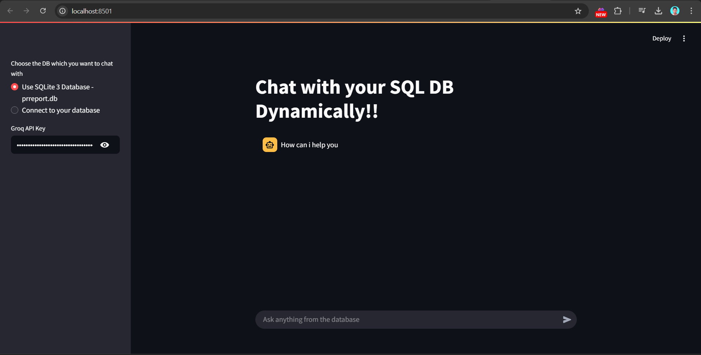

# Chat with SQL DB 💻

This project allows you to interact dynamically with your SQL database using a conversational interface powered by Streamlit and LangChain. You can connect to a local SQLite database or a remote MySQL database and query it using natural language.

## Features
- Chat with your SQL database using natural language.
- Supports both SQLite and MySQL databases.
- Powered by LangChain and Streamlit for a seamless user experience.

## Prerequisites
- Python 3.8 or higher
- Required Python libraries (install using `requirements.txt`):
    - `streamlit`
    - `langchain`
    - `langchain_community`
    - `sqlalchemy`
    - `sqlite3`
    - `mysql-connector-python`

## Installation
1. Clone the repository:
     ```bash
     git clone https://github.com/your-repo/chat-with-sql.git
     cd chat-with-sql
     ```

2. Install the required dependencies:
     ```bash
     pip install -r requirements.txt
     ```

3. Add your Groq API key to the `.env` file:
     ```
     GROQ_API_KEY=your_api_key_here
     ```

## Screenshot



## Usage
1. Run the Streamlit app:
     ```bash
     streamlit run app.py
     ```

2. Open the app in your browser at [http://localhost:8501](http://localhost:8501).

3. Choose the database you want to connect to:
     - **SQLite**: Use the pre-configured `pr_report.db` file.
     - **MySQL**: Provide your MySQL database credentials.

4. Enter your Groq API key in the sidebar.

5. Start chatting with your database by typing queries in the chat input box.

## Database Schema
The SQLite database (`pr_report.db`) contains the following table:

| Column Name     | Data Type     |
|------------------|---------------|
| pr_id           | int(20)       |
| requested_by    | varchar(25)   |
| location        | varchar(25)   |
| product_name    | varchar(25)   |
| product_id      | int(10)       |
| approved_by     | varchar(25)   |
| vendor          | varchar(25)   |
| approval_status | int(1)        |

